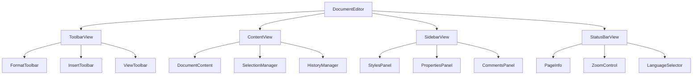
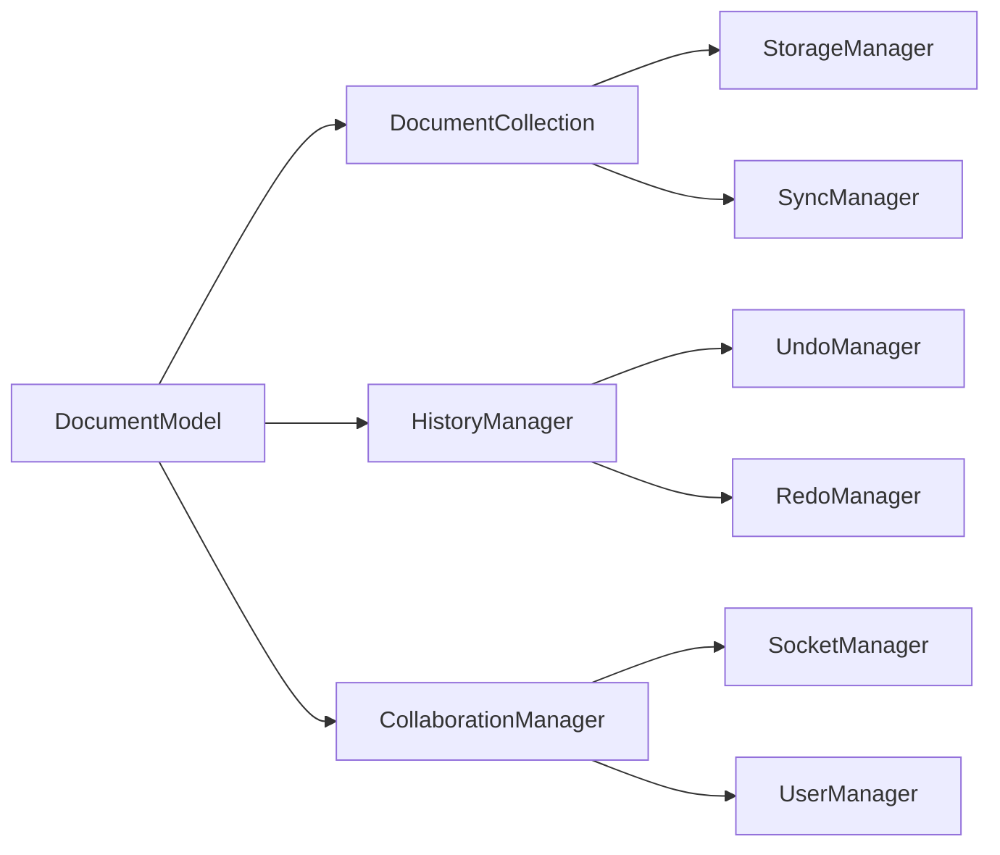
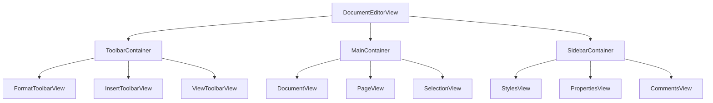
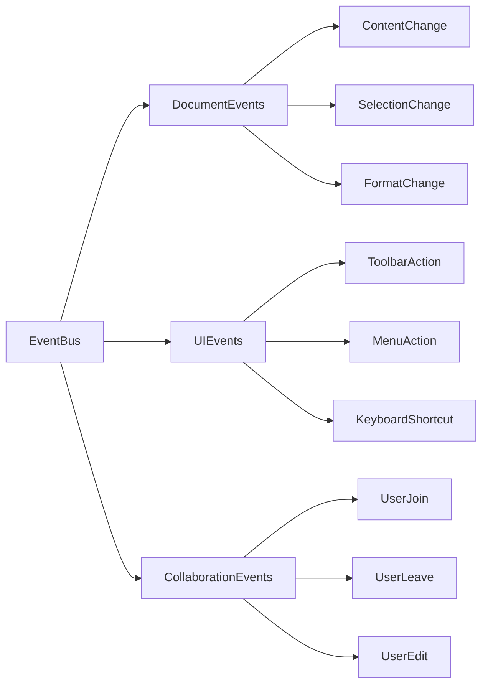

# 文档编辑器架构图

## 整体架构

## 数据流架构

## 视图层级架构

## 事件系统架构

## 组件说明

### 1. 核心组件
- **DocumentEditor**: 编辑器主容器，负责协调各个子组件
- **DocumentModel**: 文档数据模型，管理文档内容和状态
- **DocumentView**: 文档视图，负责渲染和显示文档内容

### 2. 工具栏组件
- **ToolbarView**: 工具栏容器
- **FormatToolbar**: 格式工具栏
- **InsertToolbar**: 插入工具栏
- **ViewToolbar**: 视图工具栏

### 3. 内容组件
- **ContentView**: 内容区域容器
- **PageView**: 页面视图
- **SelectionManager**: 选择管理器
- **HistoryManager**: 历史记录管理器

### 4. 侧边栏组件
- **SidebarView**: 侧边栏容器
- **StylesPanel**: 样式面板
- **PropertiesPanel**: 属性面板
- **CommentsPanel**: 评论面板

### 5. 状态栏组件
- **StatusBarView**: 状态栏容器
- **PageInfo**: 页面信息
- **ZoomControl**: 缩放控制
- **LanguageSelector**: 语言选择器

### 6. 数据管理组件
- **DocumentCollection**: 文档集合
- **StorageManager**: 存储管理器
- **SyncManager**: 同步管理器
- **CollaborationManager**: 协作管理器

### 7. 事件系统组件
- **EventBus**: 事件总线
- **DocumentEvents**: 文档事件
- **UIEvents**: 用户界面事件
- **CollaborationEvents**: 协作事件

## 技术栈

- **前端框架**: Backbone.js
- **UI 框架**: jQuery
- **样式处理**: Less
- **实时通信**: Socket.IO
- **构建工具**: Grunt, Webpack
- **测试框架**: Mocha, Chai

## 关键特性

1. **模块化设计**
   - 组件解耦
   - 可扩展性
   - 可维护性

2. **实时协作**
   - 多人编辑
   - 实时同步
   - 冲突解决

3. **性能优化**
   - 视图缓存
   - 事件节流
   - 延迟加载

4. **用户体验**
   - 响应式设计
   - 快捷键支持
   - 历史记录

5. **可扩展性**
   - 插件系统
   - 主题支持
   - 国际化 